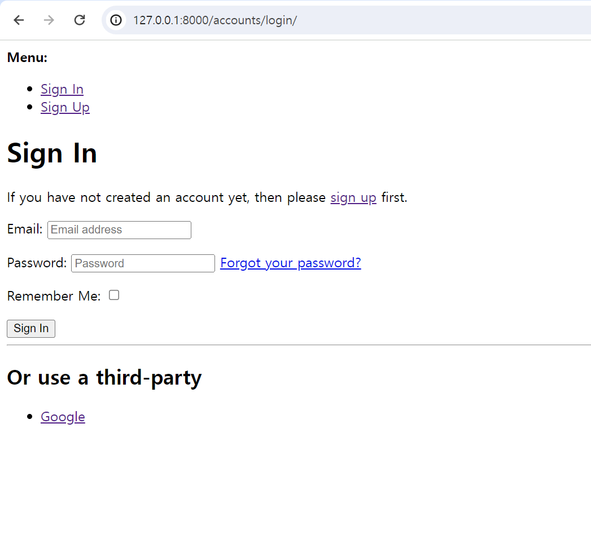
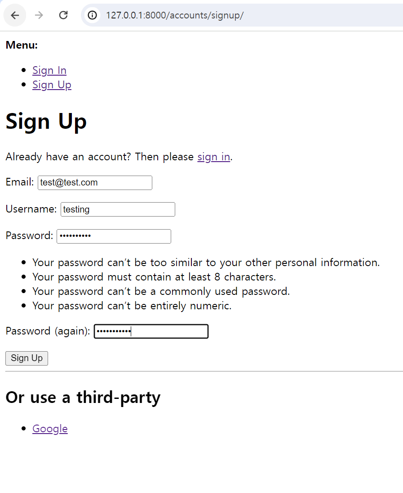
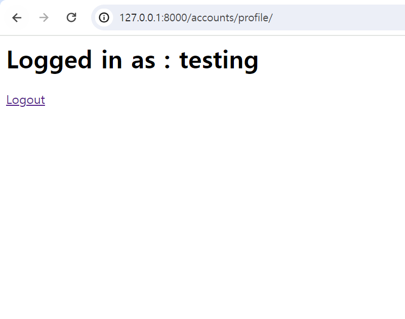
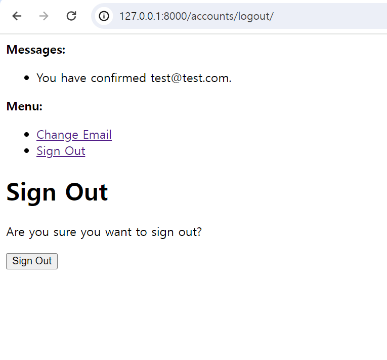
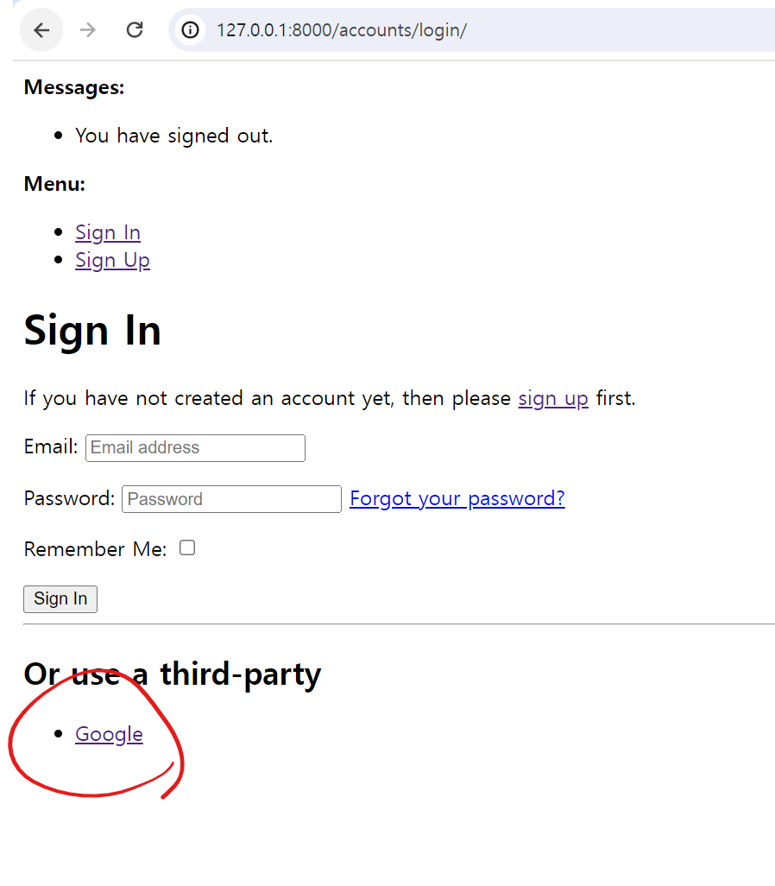
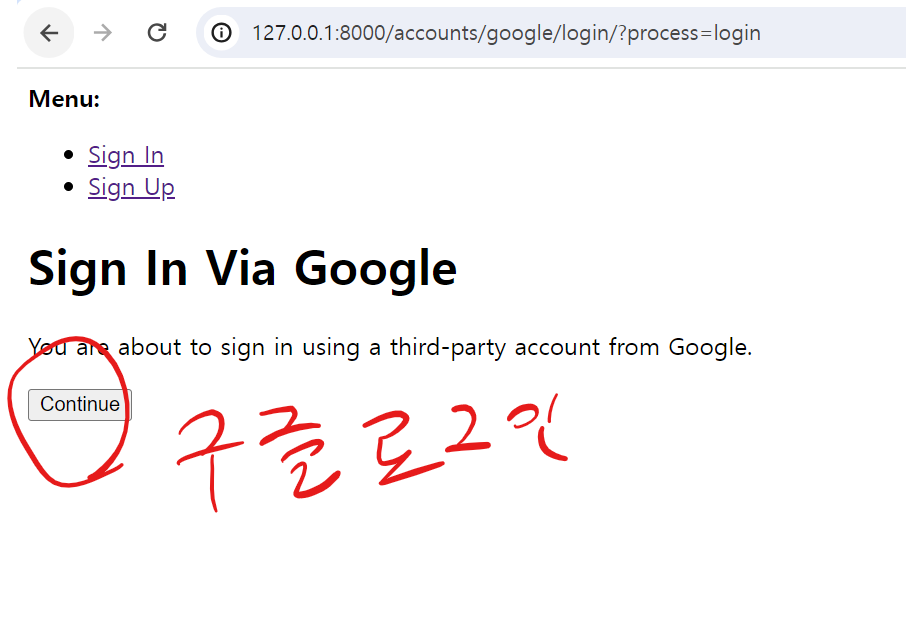
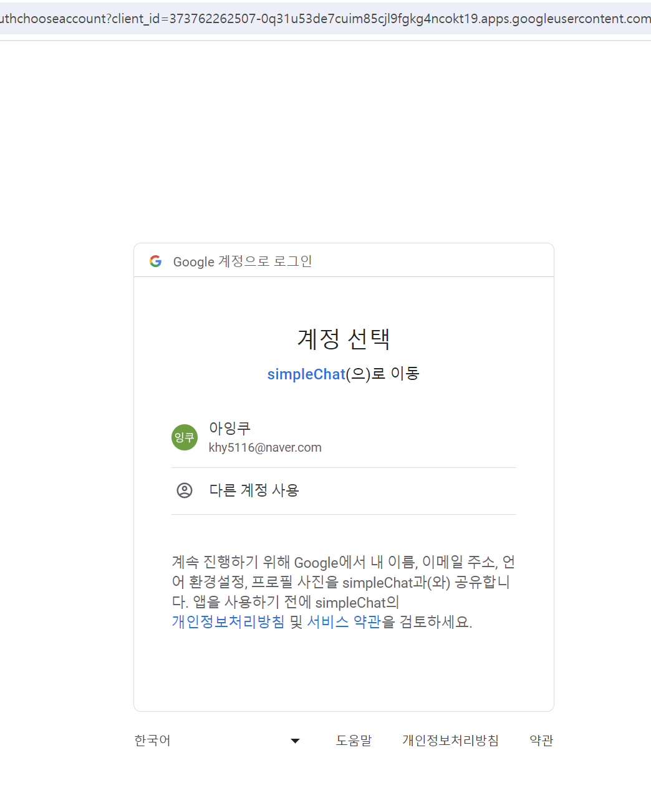
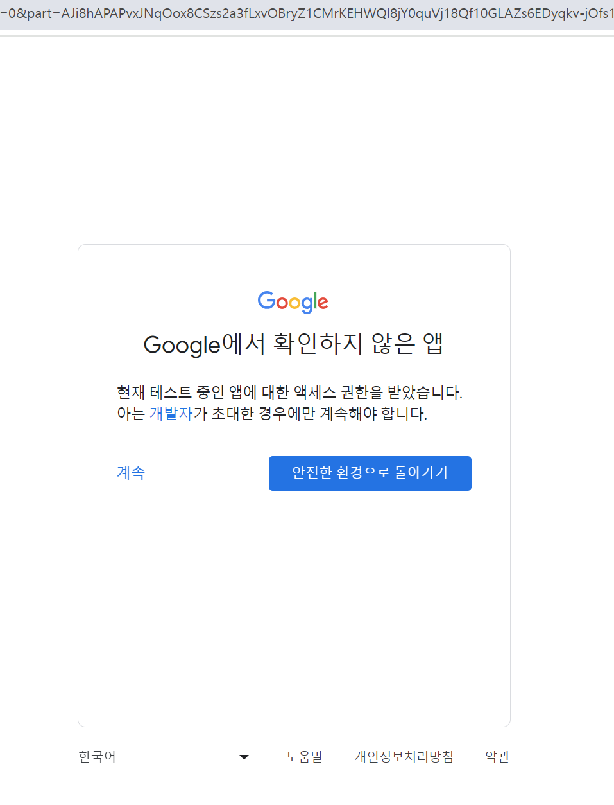
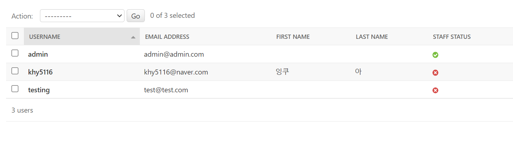
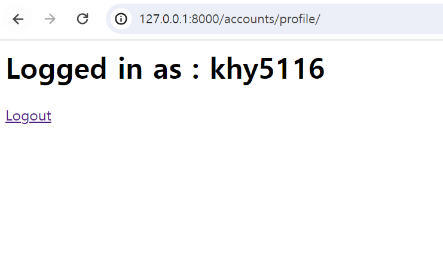

# django allauth

# DOTO LIST   
- make venv  
- pip install django  
- django-admin startproejct  
- pip install django-allauth  

--- 

  
- allauth에서 기본 제공하는 로그인 템플릿  

--- 

  
- 기본로그인 기능  
- allauth에서 이메일로 가입할경우, 인증페이지에 접속해야 가입 가능하게 하는 기능 있음.  

--- 

  
- testing 아이디로 로그인한 화면  

--- 

  
- 로그아웃 페이지  

--- 

  
- allauth 에서 여러 플렛폼의 서드파티 로그인 가능  

--- 

  
- 구글로 로그인 하는 화면  

--- 

  

--- 

  

--- 

  
- admin page에서 가입한 아이디들을 볼수있다.  

--- 

